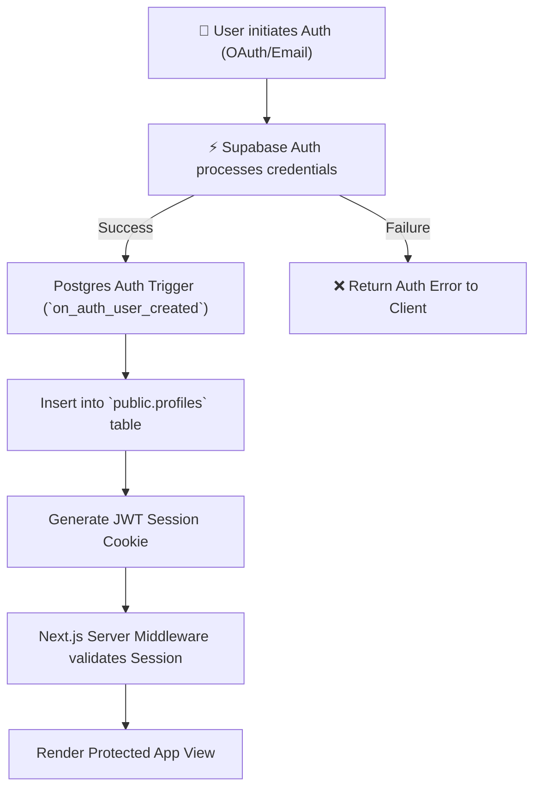
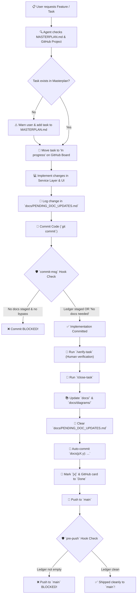
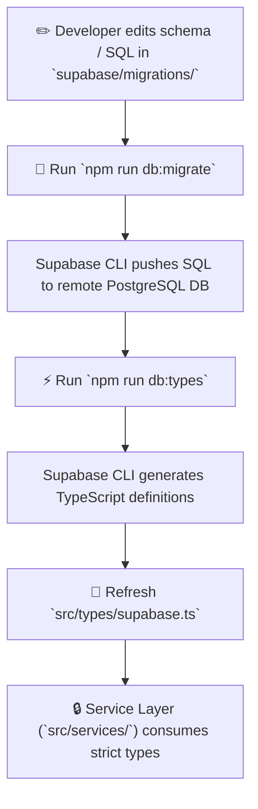
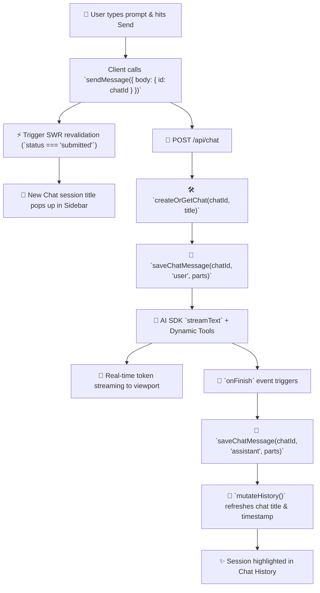

# 🔄 Activity & Workflow Diagrams

This document contains key workflow and activity diagrams illustrating core operations in **DannFlow**.

---

## 1. User Authentication & Profile Bootstrapping Workflow

---

## 2. Masterplan Task & Documentation Lifecycle Workflow

---

## 3. Database Migration & Type Sync Workflow

---

## 4. AI Secretary Conversation Lifecycle & Real-Time Sync Workflow

