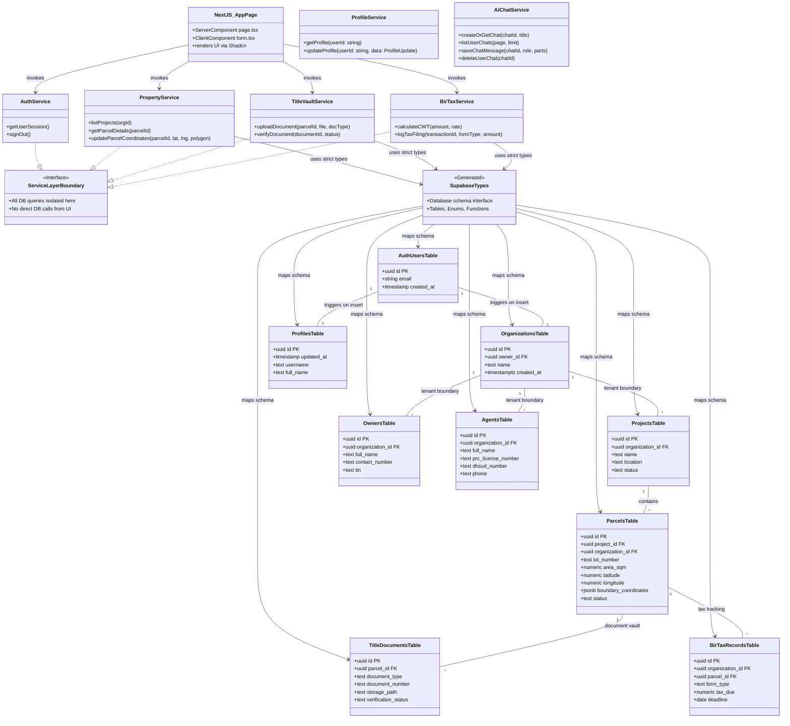

# 🏗️ Domain & Service Architecture Diagram

This diagram maps the structural relationships between Next.js UI Components, the **Service Layer** (`src/services/`), TypeScript Definitions (`src/types/`), and Supabase Backend Entities.

---

## Mermaid Domain Architecture Diagram

---

## Architectural Guidelines

1. **UI Layer Isolation**: Next.js pages and Shadcn components inside `src/app/` and `src/components/` must **never** call `supabase.from(...)` directly.
2. **Service Layer Responsibility**: All CRUD operations, tenant isolation checks, and business rules belong exclusively in `src/services/`.
3. **Type Contracts**: Functions in `src/services/` import data types strictly from `src/types/supabase.ts` (auto-generated via `npm run db:types`).
