# 📊 Use Case Diagram (System Interactions)

This document visualizes the primary actors and their interactions with the **DannFlow** system, database, and external tool integrations.

---

## Mermaid Use Case Diagram

```mermaid
graph TD
    %% Actors
    User["👤 End User / Client"]
    Admin["⚙️ System Administrator"]
    Agent["🤖 AI Coding Agent (DannFlow Engine)"]
    GitHub["🐙 GitHub Repository & MCP"]
    Supabase["⚡ Supabase (Auth, DB, RLS)"]

    %% User Interactions
    subgraph App_Boundary["🌐 DannFlow Application"]
        UC_Auth["Sign Up / Login (OAuth / Magic Link)"]
        UC_Profile["Manage Profile & Settings"]
        UC_AppFeature["Access Protected SaaS Features"]
        UC_RateLimit["Endpoint Rate Limiting (Upstash)"]
    end

    User --> UC_Auth
    User --> UC_Profile
    User --> UC_AppFeature
    UC_Auth --> Supabase
    UC_AppFeature --> UC_RateLimit
    UC_AppFeature --> Supabase

    %% Admin & Ops Interactions
    subgraph Ops_Boundary["🛠️ Developer & Ops Tasks"]
        UC_Migrate["Execute Migrations (npm run db:migrate)"]
        UC_Checkpoint["Checkpoint Live Schema (npm run checkpoint)"]
        UC_Upstream["Sync Upstream Template (/sync-upstream)"]
    end

    Admin --> UC_Migrate
    Admin --> UC_Checkpoint
    Admin --> UC_Upstream
    UC_Migrate --> Supabase
    UC_Checkpoint --> Supabase
    UC_Upstream --> GitHub

    %% AI Agent Interactions
    subgraph Agent_Boundary["🧠 AI Vibe-Coding Governance"]
        UC_Plan["Task Management (MASTERPLAN.md & Project Board)"]
        UC_ServiceLayer["Enforce Service Layer & RLS Policies"]
        UC_DocUpdate["Execute Post-Task [PX.DOC] Updates"]
    end

    Agent --> UC_Plan
    Agent --> UC_ServiceLayer
    Agent --> UC_DocUpdate
    UC_Plan --> GitHub
    UC_ServiceLayer --> Supabase
```

---

## Primary Actor Descriptions

| Actor                         | Description                                          | Key Interactions                                                 |
| :---------------------------- | :--------------------------------------------------- | :--------------------------------------------------------------- |
| **End User**                  | Unauthenticated or authenticated application visitor | Auth, profile management, protected features                     |
| **Administrator / Developer** | Local developer or system operator                   | Schema migrations, checkpoints, upstream template sync           |
| **AI Agent (DannFlow)**       | Antigravity / Claude Code pair programmer            | Masterplan management, service layer code, documentation updates |
| **Supabase**                  | Backend infrastructure (PostgreSQL, Auth, RLS)       | Data persistence, identity management, row-level security        |
| **GitHub**                    | Project management board & git remote                | Task cards tracking, version control, PR reviews                 |
