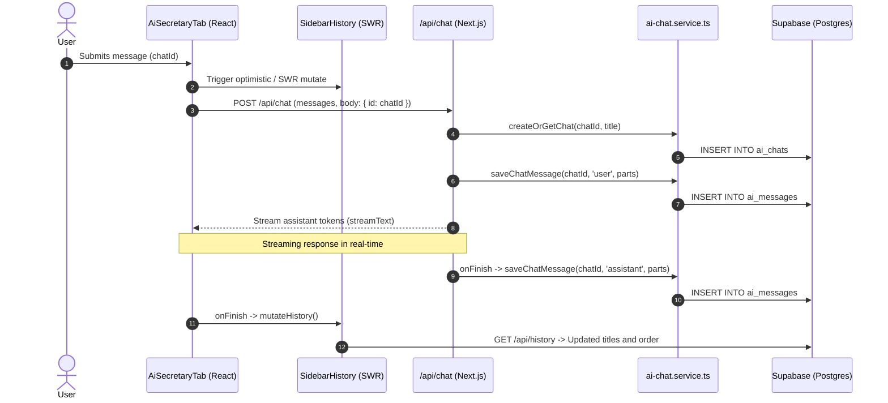

# AI Conversation Persistence & Session History Architecture

> **Audience**: Frontend & Full-Stack Engineers, AI Integrators  
> **Source Code**: `src/services/ai-chat.service.ts`, `src/app/api/chat/route.ts`, `src/app/api/history/route.ts`, `src/components/chat/sidebar-history.tsx`, `src/components/dashboard/tabs/ai-secretary-tab.tsx`

This document details how conversational AI sessions and messages are persisted, streamed, synchronized, and managed in the JuanStack AI Secretary interface.

---

## 1. System Overview & Data Flow

---

## 2. Key Architecture Components

### A. The Service Layer (`src/services/ai-chat.service.ts`)

All direct database interactions are strictly contained in this isolated service:

- **`createOrGetChat(chatId, title)`**: Finds an existing chat or automatically provisions one under the authenticated user's organization.
- **`listUserChats(page, limit)`**: Fetches paginated chat sessions sorted by `updated_at DESC` so active chats stay at the top.
- **`getChatMessages(chatId)`**: Retrieves all messages for a specific conversation in chronological order.
- **`saveChatMessage(chatId, role, parts)`**: Persists messages (`user`, `assistant`, or `system`) with full JSON parts.
- **`deleteUserChat(chatId)`**: Deletes a conversation from `ai_chats` (which cascades to `ai_messages`).
- **`updateChatTitle(chatId, title)`**: Updates a session's title (e.g. derived from the initial user prompt).

### B. Streaming Route (`src/app/api/chat/route.ts`)

- Configured with `maxDuration = 30` and AI SDK v7 streaming.
- Parses incoming requests and extracts `chatId = body.id || "secretary-chat"`.
- Awaits `createOrGetChat` and user message insertion before streaming begins, guaranteeing database persistence.
- Uses `onFinish` callback to persist the completed assistant text response.

### C. History API Route (`src/app/api/history/route.ts`)

- **`GET /api/history`**: Returns paginated list `{ chats, hasMore }`.
- **`GET /api/history?chatId=<id>`**: Returns `{ messages: [...] }` for conversation switching.
- **`DELETE /api/history?id=<id>`**: Deletes the specified conversation.

### D. Real-Time ChatGPT-Style Sidebar (`src/components/chat/sidebar-history.tsx`)

- Uses SWR infinite pagination (`useChatHistory`).
- Revalidates immediately when user submits a message and when the response completes.
- Highlights the active conversation (`currentChatId`).
- Includes a **Delete Confirmation Modal** (`ConfirmationDialog`) with destructive styling to prevent accidental deletions.
