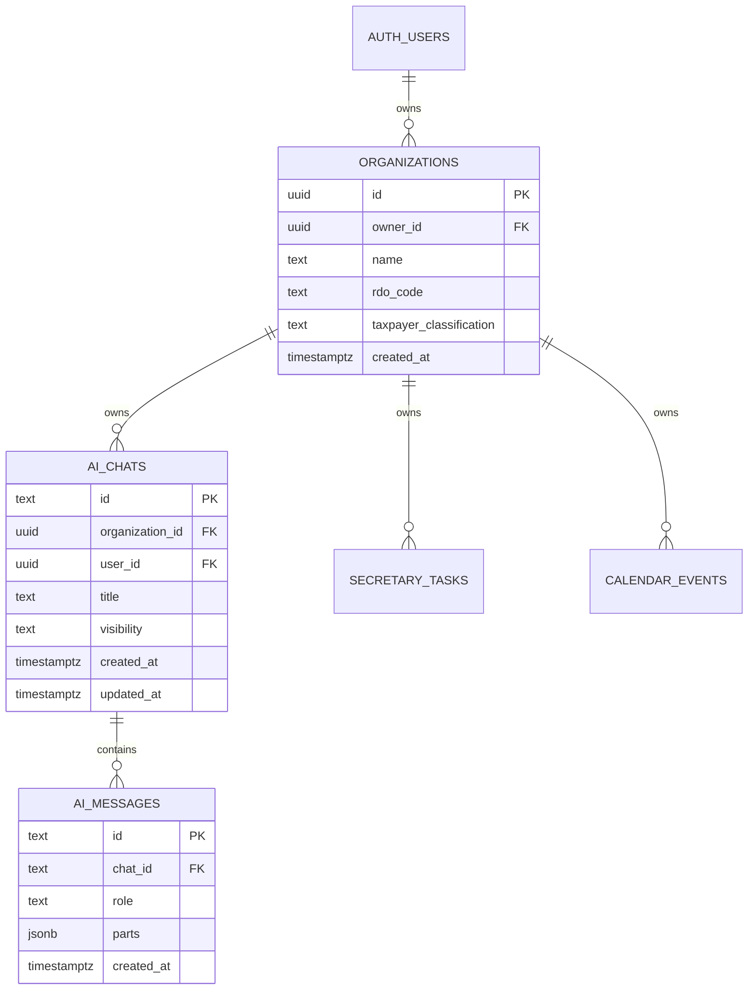

# JuanStack Multi-Tenant Database Architecture

> **Audience**: Backend Developers, AI Agents, and Database Architects  
> **Source Code**: `supabase/migrations/`, `src/services/ai-chat.service.ts`, `src/types/supabase.ts`

This document details the multi-tenant database architecture for JuanStack SaaS verticals. It explains tenant isolation, auto-provisioning triggers, and Row Level Security (RLS) enforcement.

---

## 1. Multi-Tenant Philosophy

JuanStack uses an **isolated tenant model** anchored around the `public.organizations` table:

1. Every business/office (law firm, veterinary clinic, restaurant, etc.) is represented by an **Organization**.
2. All tenant data (chats, messages, tasks, schedules, tax forms, client records) must include an `organization_id` foreign key referencing `public.organizations(id)`.
3. Database queries are protected by Row Level Security (RLS) to ensure users cannot view or mutate another tenant's records.



---

## 2. Organization Auto-Provisioning

To ensure that authenticated users immediately possess an organization without manual administrative intervention:

### A. The `handle_new_user()` Trigger Function

Defined in `supabase/migrations/20260913000003_auto_org_creation.sql`:

- Executed automatically `AFTER INSERT ON auth.users`.
- Creates a record in `public.profiles`.
- Creates a default organization in `public.organizations` with `owner_id = new.id`.

```sql
CREATE OR REPLACE FUNCTION "public"."handle_new_user"()
RETURNS "trigger"
LANGUAGE "plpgsql"
SECURITY DEFINER
AS $$
DECLARE
  org_name text;
BEGIN
  INSERT INTO public.profiles (id, email)
  VALUES (new.id, new.email)
  ON CONFLICT (id) DO NOTHING;

  org_name := COALESCE(new.raw_user_meta_data->>'full_name', split_part(new.email, '@', 1) || '''s Org', 'Default Organization');

  INSERT INTO public.organizations (owner_id, name)
  VALUES (new.id, org_name)
  ON CONFLICT DO NOTHING;

  RETURN new;
END;
$$;
```

### B. The `public.get_current_org_id()` Helper

Defined in `supabase/migrations/20260912000003_fix_core_modules.sql`:

- Allows database column definitions to set `DEFAULT public.get_current_org_id()`.
- Automatically assigns the user's active tenant ID during insert operations.

```sql
CREATE OR REPLACE FUNCTION public.get_current_org_id()
RETURNS uuid
LANGUAGE sql
STABLE
AS $$
  SELECT id FROM public.organizations WHERE owner_id = auth.uid() LIMIT 1;
$$;
```

---

## 3. Row Level Security (RLS) Policy Blueprint

Every tenant table in JuanStack must enable RLS and adhere to this exact security pattern:

### Direct Tenant Table (`ai_chats` pattern):

```sql
ALTER TABLE public.ai_chats ENABLE ROW LEVEL SECURITY;

CREATE POLICY "Users can view their organization's chats"
ON public.ai_chats FOR SELECT
USING (organization_id IN (SELECT id FROM public.organizations WHERE owner_id = auth.uid()));

CREATE POLICY "Users can insert their organization's chats"
ON public.ai_chats FOR INSERT
WITH CHECK (organization_id IN (SELECT id FROM public.organizations WHERE owner_id = auth.uid()));

CREATE POLICY "Users can delete their organization's chats"
ON public.ai_chats FOR DELETE
USING (organization_id IN (SELECT id FROM public.organizations WHERE owner_id = auth.uid()));
```

### Child/Cascading Table (`ai_messages` pattern):

```sql
ALTER TABLE public.ai_messages ENABLE ROW LEVEL SECURITY;

CREATE POLICY "Users can view messages of their organization's chats"
ON public.ai_messages FOR SELECT
USING (
    EXISTS (
        SELECT 1 FROM public.ai_chats c
        WHERE c.id = ai_messages.chat_id
        AND c.organization_id IN (SELECT id FROM public.organizations WHERE owner_id = auth.uid())
    )
);
```

Foreign keys on child tables specify `ON DELETE CASCADE` so deleting a parent chat or transaction automatically removes all child entries without leaving orphaned data.
