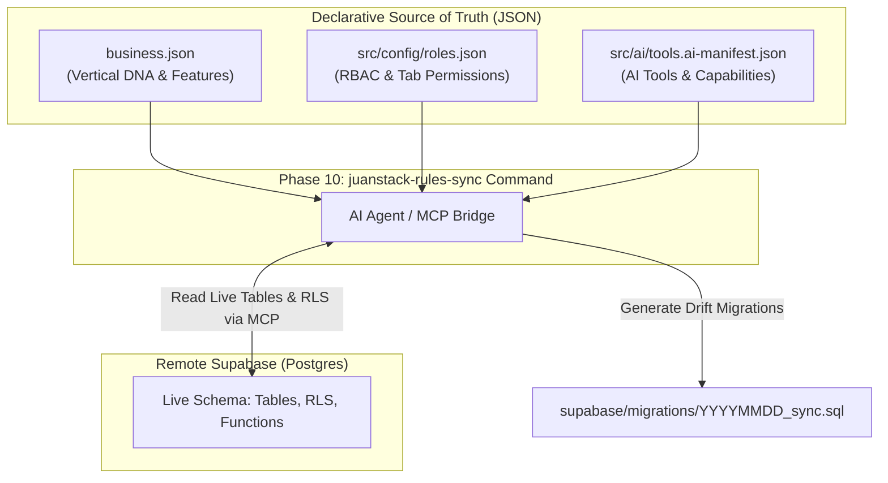

# JuanStack JSON Source of Truth & Database Synchronization Architecture

> **Target Phase**: Phase 10 (`[P10.5]` `juanstack-rules-sync` command)  
> **Audience**: AI Agents, System Architects, and Vertical Developers

This document explains the **JSON Source of Truth** architecture in JuanStack. It describes the declarative configuration files that define a vertical's features, roles, and AI capabilities, and how the upcoming `juanstack-rules-sync` command will compare them against live Supabase database schemas to detect drift and auto-generate migrations.

---

## 1. The Core Philosophy: Declarative JSON First

In JuanStack, the codebase structure, AI capabilities, and database expectations are **declarative**:

- Developers declare what a vertical needs in structured JSON files.
- The system reads these declarations at build time and runtime.
- **The database must conform to the JSON declarations**, not the other way around.



---

## 2. The Three Canonical JSON Files

### A. `business.json` (Vertical DNA & Feature Enablement)

- **Path**: `business.json` (Repository root)
- **Schema**: [`docs/juanstack/schemas/business.schema.json`](file:///Users/lesterdannlopez/Desktop/Dann_Folder/MyProjects/Work/Dannflow/docs/juanstack/schemas/business.schema.json)
- **Role**: Declares the vertical's identity, domain nomenclature (e.g. `Lawyer` vs `Veterinarian`), and toggled feature modules.

```json
{
  "vertical_id": "attyjuan",
  "name": "AttyJuan Legal Office",
  "domain_nomenclature": {
    "provider": "Lawyer",
    "consumer": "Client",
    "transaction": "Case"
  },
  "dannflow_features": {
    "auth_module": true,
    "billing_module": true,
    "bir_module": true,
    "analytics_module": true,
    "ai_secretary": true,
    "scheduling_module": true
  }
}
```

### B. `src/config/roles.json` (Role-Based Access Control)

- **Path**: `src/config/roles.json`
- **Role**: Declares canonical user roles (`super_admin`, `admin`, `member`), tab visibility, and tenant permission boundaries.

```json
{
  "roles": {
    "super_admin": {
      "name": "Super Admin",
      "allowed_tabs": [
        "overview",
        "ai-secretary",
        "schedule",
        "bir",
        "analytics",
        "blog",
        "team",
        "settings"
      ]
    },
    "admin": {
      "name": "Organization Owner",
      "allowed_tabs": [
        "overview",
        "ai-secretary",
        "schedule",
        "bir",
        "analytics",
        "team",
        "settings"
      ]
    },
    "member": {
      "name": "Team Member",
      "allowed_tabs": ["overview", "ai-secretary", "schedule", "settings"]
    }
  }
}
```

### C. `src/ai/tools.ai-manifest.json` (AI Tools & Autonomous Capabilities)

- **Path**: `src/ai/tools.ai-manifest.json`
- **Schema**: [`docs/juanstack/schemas/ai-manifest.schema.json`](file:///Users/lesterdannlopez/Desktop/Dann_Folder/MyProjects/Work/Dannflow/docs/juanstack/schemas/ai-manifest.schema.json)
- **Role**: Declares which functions the AI Secretary is allowed to execute on behalf of the user, their parameter schemas, and execution security requirements.

---

## 3. The Synchronization Contract: JSON vs Database

When `juanstack-rules-sync` runs in Phase 10, it evaluates the matrix below to ensure the live Supabase schema matches the declared JSON state:

| JSON Source              | Declared State                              | Database Requirement (Supabase)                                                        | Required RLS Policy                                                                               |
| :----------------------- | :------------------------------------------ | :------------------------------------------------------------------------------------- | :------------------------------------------------------------------------------------------------ |
| `business.json`          | `dannflow_features.ai_secretary: true`      | `public.ai_chats`<br>`public.ai_messages`                                              | Tenant isolation: `organization_id IN (SELECT id FROM organizations WHERE owner_id = auth.uid())` |
| `business.json`          | `dannflow_features.scheduling_module: true` | `public.availability_slots`<br>`public.calendar_events`                                | Tenant isolation: Providers/staff can only book or view schedules within their `organization_id`  |
| `business.json`          | `dannflow_features.bir_module: true`        | `public.bir_forms_2551q`<br>`public.bir_forms_1701q`<br>`public.bir_2307_certificates` | Strict owner/admin-only RLS; financial ledgers locked to tenant owner                             |
| `src/config/roles.json`  | `member` role excluded from `bir` & `team`  | Database functions / API endpoints                                                     | Service layer queries and Postgres RLS prevent non-admin roles from mutating organization records |
| `tools.ai-manifest.json` | Tool: `createSchedule` enabled              | `public.calendar_events` table exists with insert grants                               | Service role or user session can create schedule records                                          |

---

## 4. How `juanstack-rules-sync` Operates

When the developer or CI runs `/claude-command juanstack-rules-sync`:

```
Step 1: Read JSON Sources of Truth
  ├── Read business.json → Extract enabled dannflow_features
  ├── Read src/config/roles.json → Extract role boundaries
  └── Read src/ai/tools.ai-manifest.json → Extract active tool tables

Step 2: Inspect Live Database via Supabase MCP
  ├── list_tables (public schema)
  ├── inspect RLS policies on all tenant tables
  └── check organization_id constraints & defaults

Step 3: Diff & Drift Analysis
  ├── Compare enabled features vs existing tables
  ├── Example: bir_module === true, but public.bir_forms_2551q is missing
  └── Check RLS: Is tenant isolation active on every tenant table?

Step 4: Auto-Remediation
  ├── If drift is detected:
  │   ├── Generate supabase/migrations/YYYYMMDDHHMMSS_sync_<feature>.sql
  │   ├── Run npm run db:migrate (cloud push)
  │   └── Refresh TypeScript types: npm run db:types:remote
  └── If in sync: Output a clean green diagnostic report
```

---

## 5. Benefits for Developers & Multi-Vertical Scaling

1. **Zero Hallucination Drift**: AI agents cannot forget to create a table or accidentally skip Row Level Security when enabling a module.
2. **Instant Vertical Provisioning**: Turning on `"bir_module": true` in a new vertical's `business.json` and running `juanstack-rules-sync` will instantly provision the exact required database tables.
3. **Audit Compliance**: Guarantees that Philippine BIR data, medical/veterinary data, or attorney-client communications remain strictly segregated by tenant in Postgres.
