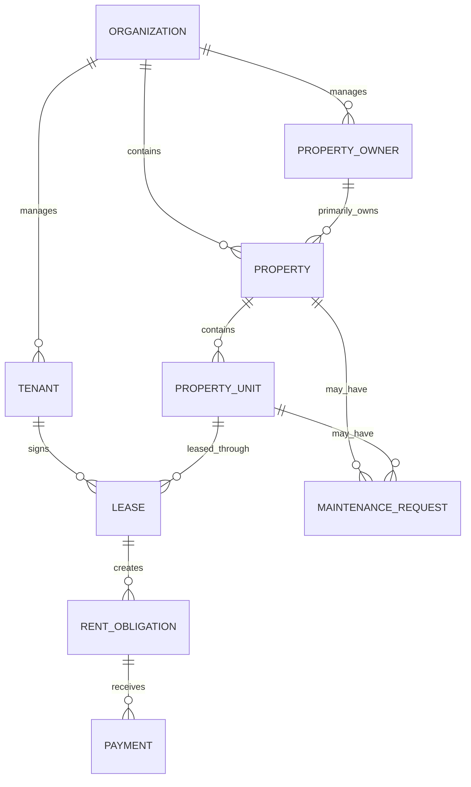

# Design Document — JuanProperty

**Project Name:** JuanProperty (Built on DannFlow)  
**Configured Vertical:** `property`
**Active Product Direction:** Core Real Estate Property Management
**Design System:** Preserve the existing approved JuanProperty visual system
**Date:** 2026-09-14
**Status:** Phase 1 Planning Baseline

---

## 1. Phase 1 Experience

JuanProperty's Phase 1 interface is an operational workspace for Property Managers and administrative staff. It favors quick record lookup, dependable forms, clear status presentation, and compact portfolio visibility across mobile field use and desktop office workflows.

Primary navigation should prioritize:

- Property Owners
- Properties
- Units
- Tenants
- Leases
- Rent Obligations
- Payments
- Maintenance
- Dashboard

AI Secretary, Scheduling, and BIR remain visible only through team-leader-owned product areas. Phase 1 Real Estate work must not redesign their interfaces or behavior.

---

## 2. Planned Domain Model

This is a planning model. Exact table definitions and constraints belong to their approved implementation tasks.

---

## 3. Core Interaction Principles

- A Tenant is associated with a Unit through a Lease, never through a permanent unit assignment.
- Historical leases, obligations, and payments remain discoverable.
- Archive actions are visually distinct from destructive deletion.
- Financial corrections explain the void/reversal and replacement chain.
- Lease conflict messages identify the conflicting period without exposing another organization's data.
- Statuses and monetary balances are presented consistently across details, lists, and dashboard summaries.
- Forms use labels above fields, visible focus/error states, and minimum 48px application controls.

---

## 4. Dashboard Information Design

The Phase 1 dashboard groups operational information into four areas:

1. **Portfolio:** properties, units, occupied units, available units, occupancy rate.
2. **Leasing:** active tenants, active leases, approaching expirations.
3. **Rent:** current-month due, current-month collected, outstanding rent, overdue obligations.
4. **Maintenance:** open requests and priority visibility.

This dashboard is an operational summary, not an advanced analytics implementation. It must consume organization-scoped service/read-model data and must not modify `src/analytics/core/`.

---

## 5. Visual and Accessibility Guardrails

- Preserve the current approved JuanProperty theme and protected hero-media behavior.
- Use Shadcn/UI primitives and Tailwind semantic tokens in application components.
- Support 375px mobile layouts without horizontal scrolling.
- Maintain at least 48px application control targets.
- Use high contrast for field conditions and efficient hierarchy for desktop administration.
- Provide loading, error, empty, archived, and permission-denied states.

---

## 6. Protected Product Areas

The Phase 1 design must not change AI Secretary, Scheduling, BIR, generic authentication, or generic DannFlow/JuanStack screens and conventions. Safe future integration is limited to presenting or exposing stable Real Estate facts through approved contracts.

---

## 7. Deferred Experience Direction

The previous land-focused experience—title vaults, parcel records, GPS/boundary maps, broker and buyer workflows, sales pipelines, transactions, and marketplace discovery—is preserved for future phases. It is not part of the active Phase 1 navigation or workflow design.
