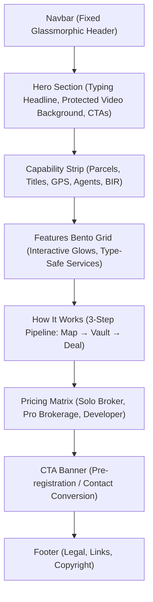

# Design Document — JuanProperty

**Project Name:** JuanProperty (Built on DannFlow)  
**Vertical:** Philippine Real Estate & Land Management (`vertical_id: property`)  
**Design System:** Emerald Forest & Earth Gold  
**Date:** 2026-09-14  
**Status:** Approved Baseline

---

## 1. Design Philosophy & Aesthetic Direction

JuanProperty is designed specifically for high-value Philippine real estate and land transactions. The aesthetic fuses **prestige corporate security** with **field-ready utility**:

- **Emerald Forest Theme:** Deep natural greens (`#0D7A5F`, `#10B981`) symbolize fertile land, property development, and sustained asset growth.
- **Earth Gold Accents:** Warm golden tones (`#D97706`, `#F59E0B`) indicate legal authenticity, title certificates, and high-value capital assets.
- **Obsidian Forest Void:** Ultra-dark background (`#050806`) provides zero glare for outdoor daylight inspections while maintaining battery efficiency on OLED mobile devices.
- **High-Density Typography:** Crisp Geist Sans and Geist Mono pairing for tabular land data, coordinates, and survey numbers.

---

## 2. Semantic Color Palette (`src/app/globals.css`)

All components utilize semantic design tokens. Hardcoded hex values in component markup are strictly prohibited.

| Token                      | Value               | Purpose                                                        |
| :------------------------- | :------------------ | :------------------------------------------------------------- |
| `--color-primary`          | `#0D7A5F`           | Primary interactive buttons, active indicators, and highlights |
| `--color-ring`             | `#10B981`           | Focus states, glowing outlines, active tab borders             |
| `--color-background`       | `#050806`           | Root body background (deep obsidian forest)                    |
| `--color-card`             | `#0A120E`           | Bento boxes, form wrappers, modal backgrounds                  |
| `--color-border`           | `#183325`           | Structural dividers and input borders                          |
| `--color-muted-foreground` | `#8E9E94`           | Secondary text, survey metadata, timestamps                    |
| `.gradient-text-primary`   | Emerald &rarr; Gold | Headings, badge shimmers, brand highlights                     |

---

## 3. Landing Page Component Breakdown

### 3.1 Hero Preservation Contract

- **Protected Assets:** `public/hero-poster.avif`, `public/hero-background.mp4`, and `public/hero-background.webm`.
- **Playback Guarantee:** Video background logic, loop parameters, and fallbacks are strictly frozen against destructive refactoring.

### 3.2 Mobile-First Site Inspection Standards

- Touch targets for all buttons, select menus, and map controls are minimum $48\text{px} \times 48\text{px}$.
- No horizontal viewport overflow at 375px mobile screen width.
- High-contrast visual hierarchy prevents element wash-out when viewing listings under direct tropical sunlight.
