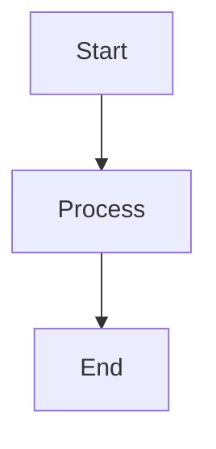

# Design Document

**Project Name:** [Project Name]  
**Date:** [YYYY-MM-DD]  
**Author:** [Your Name]  
**Status:** [Draft / Under Review / Approved]

---

## 1. Architectural Structural Plans

Provide a high-level overview of the structural design of the system.

## 2. UML & Sequence Diagrams

Embed or link to the relevant Mermaid diagrams.

### [Diagram 1 Title]

### [Diagram 2 Title]

_(Link to or embed diagram here)_
