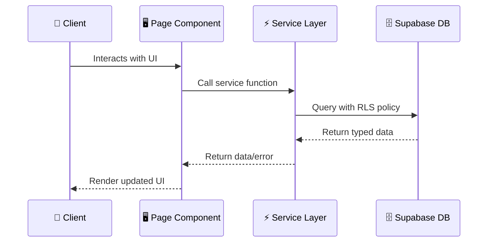

# 📄 Feature Documentation Template

> **Use this template when creating documentation for a new module, feature, or integration.** Save completed documents under `docs/dannflow_docs/<feature-name>.md`.

---

# [Feature Name]

## Overview

A brief summary of what this feature does, why it exists, and who uses it.

## Architecture & Service Boundary

- **Service File**: `src/services/<feature>-service.ts`
- **Component File(s)**: `src/components/<feature>/`
- **Database Tables / Enums**: `public.<table_name>`

## Data Flow & Workflow

Explain how data flows from UI -> Service -> Supabase DB.

## Setup & Environment Variables

List any required environment variables or third-party service setups:

- `FEATURE_API_KEY`: Key description

## RLS Security Policies

Document the Row Level Security (RLS) policy rules protecting this feature's data tables.

## Verification & Testing

How to test or verify this feature:

- Unit / Integration checks
- Manual verification steps
